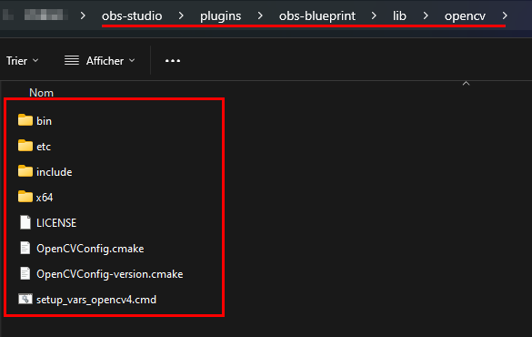
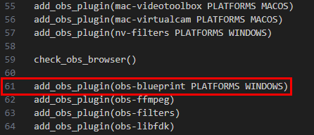
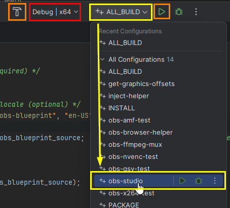

# OBS Blueprint
Blueprint visual scripting plugin for OBS Studio !

It's distributed under the GNU General Public License v2 (or any later version) - see the accompanying LICENSE file for more details.

## How to build OBS Blueprint?

> [!NOTE]  
> For now, OBS Blueprint is only compatible with Windows x64.

> [!TIP]
> If you are not familiar with software development, you can find [here](./doc/full_install.md) a step-by-step guide on how to build OBS Blueprint.

### Prerequisites

* OpenCV built libraries (tested with 4.10.0): https://docs.opencv.org/4.x/df/d65/tutorial_table_of_content_introduction.html 
 * The OpenCV module *highgui* is not used in OBS Blueprint and can be safely removed. I believe there are some other unused modules that are unused and could be disabled.
> [!IMPORTANT]
> If you want to build OBS Blueprint with CUDA (GPU), you must include OpenCV CUDA modules when building the libraries.
   
* OBS Studio project: https://github.com/obsproject/obs-studio/ 
    * You can follow https://github.com/obsproject/obs-studio/wiki/build-instructions-for-windows instructions.

* Git Bash: https://gitforwindows.org/ 

### Install

1. Open a new Git Bash at the desired location
2. Clone the OBS Studio repository: `git clone --recursive https://github.com/obsproject/obs-studio.git`
3. Go to *obs-studio/plugins* folder: `cd obs-studio/plugins`
4. Clone OBS Blueprint plugin repository: `git clone https://github.com/bukibarak/obs-blueprint`
5. Go back to OBS Studio root directory: `cd ..`
6. Copy OpenCV into *obs-studio/plugins/obs-blueprint/lib/opencv*:

7. Open *obs-studio/plugins/CMakeLists.txt* and add this line **in alphabetical order**: `add_obs_plugin(obs-blueprint PLATFORMS WINDOWS)` *(it should be before obs-ffmpeg)*

8. On the OBS Studio root directory, generate sln with CMake: `cmake --preset windows-x64`
9. Open `build_x64\obs-studio.sln` with Microsoft Visual Studio or Jetbrains Rider (or any other IDE that support SLN solutions)
10. With your IDE, open *obs-studio/plugins/obs-blueprint/obs-blueprint/opencv_conf.h* and change CUDA_AVAILABLE to 1 or 0 depending on if you want to build the plugin with GPU or CPU support.
    * *nvcc and OpenCV CUDA modules are required to build OBS Blueprint with GPU support*
11. Change the build configuration to `obs-studio`:

You can now build and run OBS studio with OBS Blueprint plugin attached!

## Authors

Made by Cédric Mujynya (Bukibarak).