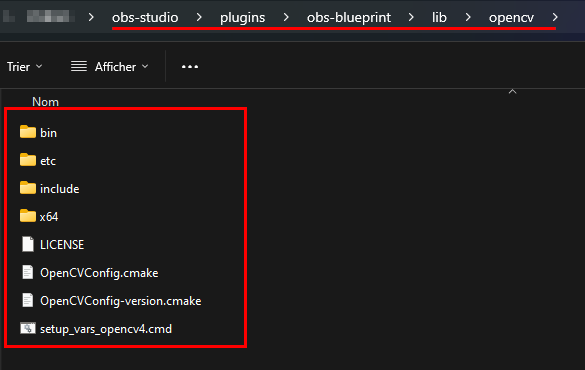

## Softwares

1. Install [Git Bash](https://gitforwindows.org/)
    * On the *Select Components* window, make sure to check **[X] Open Git Bash here** and **[X] Git LFS** 
    * All other installer options can be left as default

<!-- 2. Install [CMake](https://cmake.org/download/) (choose *Windows x64 Installer*)
    * Make sure to check **[X] Add CMake to the PATH environment variable**
    * You can use other tools such as [Cygwin](https://www.cygwin.com/install.html) or [MSYS2](https://www.msys2.org/) to install cmake and other developer tools -->

2. Install [Visual Studio Build Tools](https://visualstudio.microsoft.com/fr/downloads/#build-tools-for-visual-studio-2022) and [Rider](https://www.jetbrains.com/fr-fr/rider/download/)
* **OR**
2. Install [Visual Studio Community](https://visualstudio.microsoft.com/fr/downloads/)<br/>

*I do not like Visual Studio IDE, so I recommand using the JetBrains Rider IDE. Both tools are free for non-commercial projects. In the next parts of this tutorial, I will use Rider and VS Build Tools.*

4. From the Windows start menu, execute *Visual Studio Installer*. Then, click the **[Modify]** button
5. On the top menu, select **Individual components**
6. Check the following:
    * **[X] Windows 11 SDK (10.0.22621.0)** (higher version may be required for future version of OBS Studio. Please see [prerequisites](https://github.com/obsproject/obs-studio/wiki/build-instructions-for-windows#prerequisites))
    * **[X] C++ CMake tools for Windows**
    * **[X] MSVC v143 - VS 2022 C++ x64/x86 build tools (Latest)**
    * **[X] C++ ATL for latest v143 build tools (x86 & x64)**


Then, click the **[Modify]** button at the bottom right of the window and wait for the installation to complete.

7. Using the Windows search bar, type `cmd` and open the command-line interface
8. Type `where.exe cmake` and press enter. If you have an error message like *unable to find files for specified model(s)* or if the first path is not part of Visual Studio, then you need to add the following lines on the top of your **PATH** environment variable (see [this tutorial](https://www.architectryan.com/2018/03/17/add-to-the-path-on-windows-10/)) :
    * *If you have installed VS Build Tools 2022:*
        * `C:\Program Files (x86)\Microsoft Visual Studio\2022\BuildTools\Common7\IDE\CommonExtensions\Microsoft\CMake\CMake\bin`
        * `C:\Program Files (x86)\Microsoft Visual Studio\2022\BuildTools\Common7\IDE\CommonExtensions\Microsoft\CMake\Ninja`
    * *If you have installed VS Community 2022:*
        * `C:\Program Files (x86)\Microsoft Visual Studio\2022\Community\Common7\IDE\CommonExtensions\Microsoft\CMake\CMake\bin`
        * `C:\Program Files (x86)\Microsoft Visual Studio\2022\Community\Common7\IDE\CommonExtensions\Microsoft\CMake\Ninja`
> [!NOTE]
> If you have installed Visual Studio on a custom location, you must change the beginning of the paths according to your install location.


9. Close the environment variable windows.
10. Close and re-open the command-line interface. Type again `where.exe cmake`. This time the Visual studio path should appear.


> [!CAUTION]
> The next two steps are only required if you want to run OBS-Blueprint on the GPU (CUDA)

11. Install [CUDA Toolkit](https://developer.nvidia.com/cuda-toolkit)
12. Close all command-line interfaces and open one again by typing `cmd` in the Windows search bar. Then, type `where.exe nvcc`. If you have a path with "*.../NVIDIA GPU Computing Toolkit/CUDA/v12.6/...*" then you should be good!


## Install - OpenCV

1. At the desired location, create a new directory named *OpenCV_Build* and open it with the Explorer.
2. Right click somewhere inside the directory to show the context menu, then select **Choose more options..** > **Open Git Bash here**
3. Type `touch install.sh` and press enter.
4. Type `notepad install.sh` and press enter.
5. Copy this content inside the file, then save the file and close the notepad window:
* *With GPU (CUDA):*
```bash
#!/bin/bash -e
myRepo=$(pwd)
#CMAKE_GENERATOR_OPTIONS=-G"Visual Studio 16 2019"
#CMAKE_GENERATOR_OPTIONS=-G"Visual Studio 15 2017 Win64"
#CMAKE_GENERATOR_OPTIONS=(-G"Visual Studio 16 2019" -A x64)  # CMake 3.14+ is required
CMAKE_GENERATOR_OPTIONS=(-G"Visual Studio 17 2022" -A x64)
if [  ! -d "$myRepo/opencv"  ]; then
    echo "cloning opencv"
    git clone https://github.com/opencv/opencv.git
else
    cd opencv
    git pull --rebase
    cd ..
fi
if [  ! -d "$myRepo/opencv_contrib"  ]; then
    echo "cloning opencv_contrib"
    git clone https://github.com/opencv/opencv_contrib.git
else
    cd opencv_contrib
    git pull --rebase
    cd ..
fi
RepoSource=opencv
mkdir -p build_opencv
pushd build_opencv
CMAKE_OPTIONS=(-DBUILD_opencv_highgui:BOOL=OFF -DBUILD_PERF_TESTS:BOOL=OFF -DBUILD_TESTS:BOOL=OFF -DBUILD_DOCS:BOOL=OFF -DBUILD_EXAMPLES:BOOL=OFF -DWITH_CUDA:BOOL=ON -DINSTALL_CREATE_DISTRIB=ON)
set -x
cmake "${CMAKE_GENERATOR_OPTIONS[@]}" "${CMAKE_OPTIONS[@]}" -DOPENCV_EXTRA_MODULES_PATH="$myRepo"/opencv_contrib/modules -DCMAKE_INSTALL_PREFIX="$myRepo/lib/$RepoSource" "$myRepo/$RepoSource"
echo "************************* $Source_DIR -->debug"
cmake --build .  --config debug
echo "************************* $Source_DIR -->release"
cmake --build .  --config release
cmake --build .  --target install --config release
cmake --build .  --target install --config debug
popd
```

* *With CPU (no CUDA):*
```bash
#!/bin/bash -e
myRepo=$(pwd)
#CMAKE_GENERATOR_OPTIONS=-G"Visual Studio 16 2019"
#CMAKE_GENERATOR_OPTIONS=-G"Visual Studio 15 2017 Win64"
#CMAKE_GENERATOR_OPTIONS=(-G"Visual Studio 16 2019" -A x64)  # CMake 3.14+ is required
CMAKE_GENERATOR_OPTIONS=(-G"Visual Studio 17 2022" -A x64)
if [  ! -d "$myRepo/opencv"  ]; then
    echo "cloning opencv"
    git clone https://github.com/opencv/opencv.git
else
    cd opencv
    git pull --rebase
    cd ..
fi
if [  ! -d "$myRepo/opencv_contrib"  ]; then
    echo "cloning opencv_contrib"
    git clone https://github.com/opencv/opencv_contrib.git
else
    cd opencv_contrib
    git pull --rebase
    cd ..
fi
RepoSource=opencv
mkdir -p build_opencv
pushd build_opencv
CMAKE_OPTIONS=(-DBUILD_opencv_highgui:BOOL=OFF -DBUILD_PERF_TESTS:BOOL=OFF -DBUILD_TESTS:BOOL=OFF -DBUILD_DOCS:BOOL=OFF -DBUILD_EXAMPLES:BOOL=OFF -DWITH_CUDA:BOOL=OFF -DINSTALL_CREATE_DISTRIB=ON)
set -x
cmake "${CMAKE_GENERATOR_OPTIONS[@]}" "${CMAKE_OPTIONS[@]}" -DOPENCV_EXTRA_MODULES_PATH="$myRepo"/opencv_contrib/modules -DCMAKE_INSTALL_PREFIX="$myRepo/lib/$RepoSource" "$myRepo/$RepoSource"
echo "************************* $Source_DIR -->debug"
cmake --build .  --config debug
echo "************************* $Source_DIR -->release"
cmake --build .  --config release
cmake --build .  --target install --config release
cmake --build .  --target install --config debug
popd
```

> [!NOTE]
> If you don't use Visual Studio 2022 x64, you need to change the line with `CMAKE_GENERATOR_OPTIONS` and set it to your architecture. If you don't need to build Debug libraries, comment the script lines 29, 30 and 34.

6. Inside Git Bash, type `./install.sh` and press enter. **THIS WILL TAKE LIKE FOREVER, DO NOT PANIK** (with CUDA and both Debug and Release libraries it can take more than 2 hours)
> [!IMPORTANT]
> If you try to build OpenCV with GPU (CUDA), make sure to verify that OpenCV CUDA modules will be built on the OpenCV General configuration (see image below). If not (the CUDA modules are listed as *Unavailable*), abort the operation with Ctrl+C and make sure that both Git Bash and CMake can find nvcc.<br/>Sometimes, adding a new environment variable (not in the PATH) named `CUDA_PATH` with the path of cuda as a value `C:\Program Files\NVIDIA GPU Computing Toolkit\CUDA\v12.6` can solve this problem. You may need to add other environment variables, such as `CUDNN_INCLUDE_DIR` and `CUDNN_LIBRARY`. [Detailled tutorial](https://medium.com/@batuhanhangun/opencv454-gpu-support-cpp-bef2cc145090)


*For more information about the OpenCV install script configuration, please see: https://docs.opencv.org/4.x/db/d05/tutorial_config_reference.html*


## Install - OBS with OBS-Blueprint

1. At the desired location, create a new directory named *OBS_Build* and open it with the Explorer.
2. Right click somewhere inside the directory to show the context menu, then select **Choose more options..** > **Open Git Bash here**.
3. Type `git clone --recursive https://github.com/obsproject/obs-studio.git` and press enter. Wait until the clone is complete.
4. Type `cd obs-studio` and press enter.
5. Type `cd plugins` and press enter.
6. Type `git clone https://github.com/bukibarak/obs-blueprint.git` and press enter. Wait until the clone is complete.
7. Type `notepad CMakeLists.txt` and press enter.
8. On the line 60, just before *add_obs_plugin(obs-ffmpeg)*, add a new line and type: `add_obs_plugin(obs-blueprint PLATFORMS WINDOWS)`. Save the file and close the notepad.


9.  duplicate or move the directory `OpenCV_Build/lib` into `OBS_Build/obs-studio/plugins/obs-blueprint/` with the Explorer.



10. Go back to the Git Bash window, type `cd ..` and press enter.
11. Type `cmake --list-presets` and press enter. You should have *"windows-x64"* listed.


12. Type `cmake --preset windows-x64` and wait for the build to complete.
13. Type `cd build_x64`
14. Type `rider obs-studio.sln`. You may want to open Rider once before in order to complete the setup (if it is the first time that you use Rider).
15. If prompted for untrusted solution, choose **Trust and Open**.
16. *(you can skip this step if you don't need GPU with CUDA)* On the left pannel, with the solution explorer, click on **plugins** > **obs-blueprint** > **obs-blueprint** > **opencv-conf.h** and change the first line of the file:
    * `#define CUDA_AVAILABLE 0`
    * to
    * `#define CUDA_AVAILABLE 1`
17. On the top right corner, click on *"ALL_BUILD"*, (yellow box on the image below) then expand *All Configurations* and choose **obs-studio**
18. On the left, click on *"Debug | x64"* (red box on image below) to choose your build configuration. If you want best performances, choose **Release**.
19. Then, click the hammer to build OBS or the play button to build and execute OBS (orange boxes on image below).


> [!NOTE]
> If the build fails on the first time, try to rebuild once again. I believe because OBS is a big and complex C/C++ project some dependencies are not always created on the first build. If the build continue to fail, you should investigate with the error message on how to resolve the issue.

**That's it!** You can find the OBS software built with OBS blueprint inside `OBS_Build/obs-studio/build_x64/rundir/...` (Debug or Release depending on the build selected). The OBS executable is located under `.../bin/64bit/obs64.exe`. You may want to create a shortcut from this to your desktop.


If you want to share the plugin to others, copy the following file into OBS program directory:
* `OBS_Build/obs-studio/build_x64/rundir/Release/data/obs-plugins/obs-blueprint` --> `C:/Program Files/obs-studio/data/obs-plugins/`
* `OBS_Build/obs-studio/build_x64/rundir/Release/obs-plugins/64bit/obs-blueprint.dll` --> `C:/Program Files/obs-studio/obs-plugins/64bit/`
* `OBS_Build/obs-studio/build_x64/rundir/Release/obs-plugins/64bit/obs-blueprint.pdb` --> `C:/Program Files/obs-studio/obs-plugins/64bit/`
* `OBS_Build/obs-studio/build_x64/rundir/Release/obs-plugins/64bit/opencv_world4100.dll` --> `C:/Program Files/obs-studio/obs-plugins/64bit/`

You don't need to copy `opencv_world4100d.dll`, this library is only used on debug builds.